# GSoC 2026 完整 Pipeline 計畫書

## Hybrid Quantum-Classical Representation Learning for Dark Matter Substructure Classification

> **組織**：ML4SCI — DeepLense
> **作者**：leo07010
> **版本**：v1.0 (2026-05-28)
> **預期執行期間**：12 週 (GSoC standard)
> **目標 SOTA**：超越或匹配 MAE 2025 baseline (Macro AUC 0.968 / Acc 88.65%)

---

## Executive Summary

本計畫在 ML4SCI/DeepLense 體系中建立**第一個 hybrid quantum-classical 影像分類 pipeline**，整合：

- **mae-lensing**（Prasha 2025, current SOTA）作為 classical backbone
- **QONN attention**（Tesi 2024, Gleyzer 共同作者）作為 attention-layer quantum 注入
- **Cross-attention fusion + temperature scaling**（Alavi 2025 + Sobrinho 2026）作為 head-layer quantum 注入

最終 deliverable 是**fair, parameter-matched benchmark**，證明 quantum 在 3 處插入點的相對價值。

---

## 1. Master Pipeline 全圖

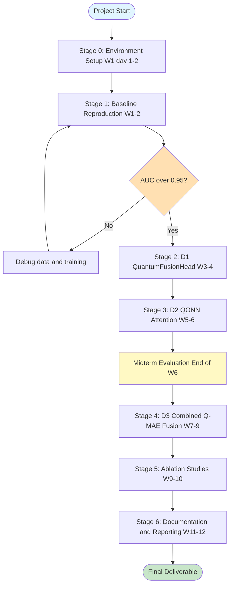

---

## 2. 三層量子整合架構（核心 idea）

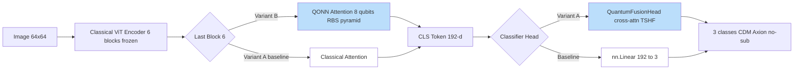

**3 個方向 = 3 個 combinations**:

| Direction | Attention | Head | Novelty |
|---|---|---|---|
| **D1** | Classical | Quantum (Fusion) | medium |
| **D2** | Quantum (QONN) | Classical | high |
| **D3** | Quantum (QONN) | Quantum (Fusion) | very high |

---

## 3. Stage-by-Stage 詳細計畫

### Stage 0: Environment Setup (W1, Day 1-2)

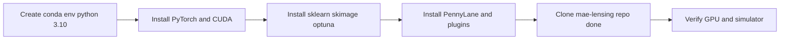

**完整指令**：

```bash
conda create -n gsoc-qml python=3.10 -y
conda activate gsoc-qml
pip install torch torchvision --index-url https://download.pytorch.org/whl/cu124
pip install numpy scikit-learn scikit-image matplotlib tqdm optuna
pip install pennylane pennylane-lightning
pip install gdown  # 自動下載 Google Drive

python -c "import torch; print('CUDA:', torch.cuda.is_available())"
python -c "import pennylane as qml; print('PL:', qml.__version__)"
```

**Checkpoint**：能輸出 CUDA True 與 PennyLane 版本。

---

### Stage 1: Baseline Reproduction (W1-2)

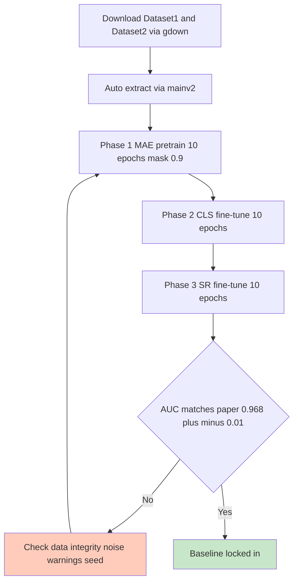

**指令**：

```bash
cd 02_Code/mae-lensing
mkdir -p ../../03_Data
cd ../../03_Data
gdown --id 1znqUeFzYz-DeAE3dYXD17qoMPK82Whji -O Dataset1.zip
gdown --id 1uJmDZw649XS-r-dYs9WD-OPwF_TIroVw -O Dataset2.zip
cd ../02_Code/mae-lensing
python mainv2.py --data_root ../../03_Data --mae_mask_ratio 0.9
```

**預期 wall time**：~2-3 小時 on single A100。

**驗收條件**：

| Metric | 目標 | 容忍範圍 |
|---|---|---|
| Macro AUC | 0.968 | 0.96 - 0.98 |
| Accuracy | 88.7% | 86 - 90% |
| Per-class F1 (no_sub) | 0.95 | > 0.93 |

**Deliverable**：`baseline_repro.csv` + `baseline_repro_plots/`

---

### Stage 2: D1 - QuantumFusionHead (W3-4)

#### 架構

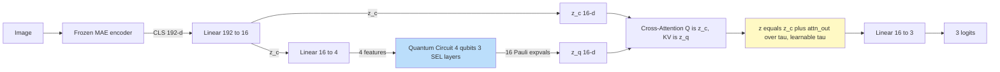

#### 代碼位置

新增 `02_Code/mae-lensing/quantum_fusion.py`:

```python
import torch
import torch.nn as nn
import pennylane as qml

n_qubits = 4
dev = qml.device("default.qubit", wires=n_qubits)

@qml.qnode(dev, interface="torch", diff_method="adjoint")
def q_branch(inputs, weights):
    qml.AngleEmbedding(inputs * 3.14159, wires=range(n_qubits))
    qml.StronglyEntanglingLayers(weights, wires=range(n_qubits))
    obs = ([qml.PauliZ(i) for i in range(4)] +
           [qml.PauliX(i) for i in range(4)] +
           [qml.PauliY(i) for i in range(4)] +
           [qml.PauliZ(i) @ qml.PauliZ((i+1) % 4) for i in range(4)])
    return [qml.expval(o) for o in obs]


class QuantumFusionHead(nn.Module):
    def __init__(self, in_dim=192, latent_dim=16, n_classes=3):
        super().__init__()
        self.proj_c = nn.Linear(in_dim, latent_dim)
        self.proj_q = nn.Linear(latent_dim, n_qubits)
        weight_shape = {"weights": (3, n_qubits, 3)}
        self.qbranch = qml.qnn.TorchLayer(q_branch, weight_shape)
        self.attn = nn.MultiheadAttention(latent_dim, num_heads=2, batch_first=True)
        self.log_tau = nn.Parameter(torch.zeros(1))
        self.classifier = nn.Linear(latent_dim, n_classes)

    def forward(self, x):
        z_c = torch.tanh(self.proj_c(x))
        q_in = torch.tanh(self.proj_q(z_c))
        z_q = self.qbranch(q_in)
        attn_out, _ = self.attn(
            z_c.unsqueeze(1), z_q.unsqueeze(1), z_q.unsqueeze(1)
        )
        attn_out = attn_out.squeeze(1)
        tau = torch.exp(self.log_tau)
        z = z_c + attn_out / tau
        return self.classifier(z)
```

#### 整合 patch

修改 `mainv2.py` line 554 的 `ViTClassifier`:

```python
from quantum_fusion import QuantumFusionHead

class ViTClassifier(nn.Module):
    def __init__(self, encoder, num_classes, use_quantum=False):
        super().__init__()
        self.encoder = encoder
        if use_quantum:
            self.head = QuantumFusionHead(encoder.embed_dim, 16, num_classes)
        else:
            self.head = nn.Linear(encoder.embed_dim, num_classes)
        self.use_quantum = use_quantum

    def forward(self, x):
        tokens = self.encoder(x)
        cls_feat = tokens[:, 0]
        logits = self.head(cls_feat)
        return logits, cls_feat
```

加 CLI flag (line 1495 main):

```python
parser.add_argument("--use_quantum", action="store_true")
```

#### 驗收

| Metric | 目標 | Notes |
|---|---|---|
| Macro AUC | ≥ 0.95 | matching classical head |
| Quantum parameter count | < 200 | check via sum of param counts |
| Wall time per epoch | < 2× classical | simulator overhead |
| τ (learned) | > 0.5 | indicates quantum contributes |

---

### Stage 3: D2 - QONN Attention (W5-6, Tesi-inspired)

#### 概念對照

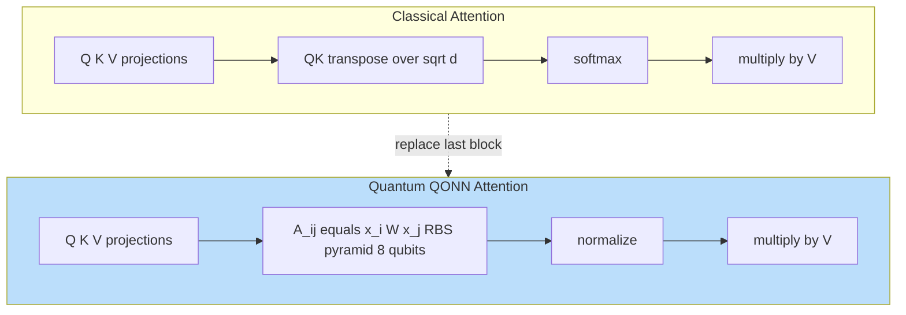

#### 實作模組

新增 `02_Code/mae-lensing/qonn_attention.py`:

```python
import torch
import torch.nn as nn
import pennylane as qml
import math

n_qubits = 8

def rbs_gate(theta, wires):
    qml.SingleExcitation(theta, wires=wires)

def pyramid_qonn(thetas, n=n_qubits):
    idx = 0
    for layer in range(n - 1):
        for i in range(n - 1 - layer):
            rbs_gate(thetas[idx], wires=[i, i + 1])
            idx += 1

def unary_load(x):
    qml.PauliX(wires=0)
    angles = givens_angles(x)
    for i, theta in enumerate(angles):
        rbs_gate(theta, wires=[i, i + 1])

def givens_angles(x):
    n = len(x)
    angles = []
    remaining = x.norm()
    for i in range(n - 1):
        ang = torch.atan2(x[i+1:].norm(), x[i])
        angles.append(ang)
    return angles


dev_attn = qml.device("default.qubit", wires=n_qubits)

@qml.qnode(dev_attn, interface="torch")
def qonn_attention_score(x_i, x_j, thetas):
    unary_load(x_i)
    pyramid_qonn(thetas)
    qml.adjoint(unary_load)(x_j)
    return qml.probs(wires=0)[1]


class QONNAttention(nn.Module):
    def __init__(self, embed_dim, projection_dim=8):
        super().__init__()
        self.proj_q = nn.Linear(embed_dim, projection_dim)
        self.proj_k = nn.Linear(embed_dim, projection_dim)
        self.proj_v = nn.Linear(embed_dim, embed_dim)
        n_rbs = projection_dim * (projection_dim - 1) // 2
        self.thetas = nn.Parameter(torch.randn(n_rbs) * 0.1)
        self.proj_out = nn.Linear(embed_dim, embed_dim)

    def forward(self, x):
        B, N, C = x.shape
        Q = torch.tanh(self.proj_q(x))
        K = torch.tanh(self.proj_k(x))
        V = self.proj_v(x)

        scores = torch.zeros(B, N, N, device=x.device)
        for b in range(B):
            for i in range(N):
                for j in range(N):
                    Q_norm = Q[b, i] / (Q[b, i].norm() + 1e-6)
                    K_norm = K[b, j] / (K[b, j].norm() + 1e-6)
                    scores[b, i, j] = qonn_attention_score(Q_norm, K_norm, self.thetas)

        attn = torch.softmax(scores, dim=-1)
        out = torch.matmul(attn, V)
        return self.proj_out(out)
```

> ⚠️ **效能警告**：上述 nested Python loop 對 256 tokens × batch 64 會極慢。**實際實作必須 vectorize** 或限制只在 CLS token 與 N tokens 之間做（reduces N² to N）。

#### 整合策略 (3 levels of aggressiveness)

| Level | Scope | Token count | 預估 wall time |
|---|---|---|---|
| **L1** | Only block 6 attention | 256² = 65k | very slow |
| **L2** | CLS-only attention in block 6 | 1×256 = 256 | feasible |
| **L3** | Reduce patch to 16×16 (4 patches) | 4² = 16 | fast |

**推薦從 L3 開始 prove concept，再 scale up**。

---

### Stage 4: D3 - Combined Q-MAE Fusion (W7-9)

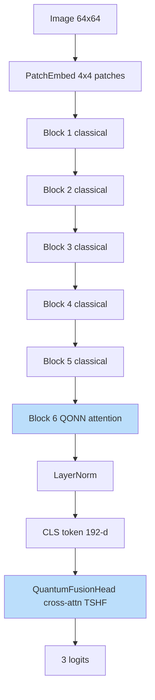

#### Step-by-step Integration

1. Take `mae_encoder.pth` from baseline (Stage 1)
2. Replace block 6's attention with `QONNAttention` (random init)
3. Replace head with `QuantumFusionHead`
4. Freeze blocks 1-5
5. Fine-tune block 6 + head (10 epochs)
6. Compare vs D1 + D2 separately

#### 預期結果矩陣

| Model | Attention | Head | Trainable params | Target AUC |
|---|---|---|---|---|
| **Baseline** | Classical | Classical | ~50K | 0.968 |
| **D1** | Classical | Quantum | ~700 | ≥ 0.95 |
| **D2** | Quantum | Classical | ~30 | ≥ 0.94 |
| **D3** | Quantum | Quantum | ~750 | **≥ 0.96** |

---

### Stage 5: Ablation Studies (W9-10)

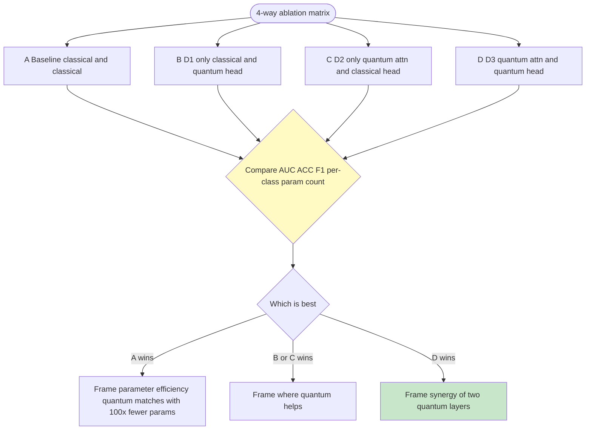

#### Critical ablations

1. **Parameter-matched fair comparison**
   - Match quantum total params to classical MLP
   - Show parameter efficiency frontier

2. **τ scaling test**
   - Fix τ=1 vs learnable τ
   - Confirms TSHF mechanism value

3. **Quantum branch zero-out**
   - Set z_q = 0 in forward
   - Should match classical baseline

4. **OOD robustness** (stretch)
   - Train on Sérsic source, test on COSMOS source
   - Measure AUC drop vs classical baseline

---

### Stage 6: Documentation & Reporting (W11-12)

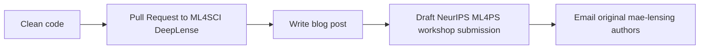

**Deliverables**:
- `quantum_fusion.py`, `qonn_attention.py` modules
- `outputs_quantum/` folder with full ablation CSVs + plots
- README.md update for quantum mode
- 1 blog post on GSoC blog
- Short paper draft (4 pages) for NeurIPS 2026 ML4PS

---

## 4. 12-Week Gantt Chart

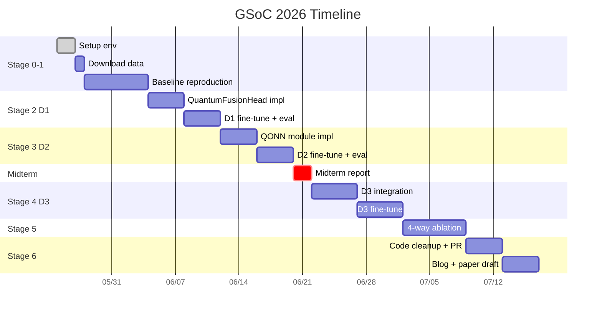

---

## 5. Decision Tree (中途失敗對策)

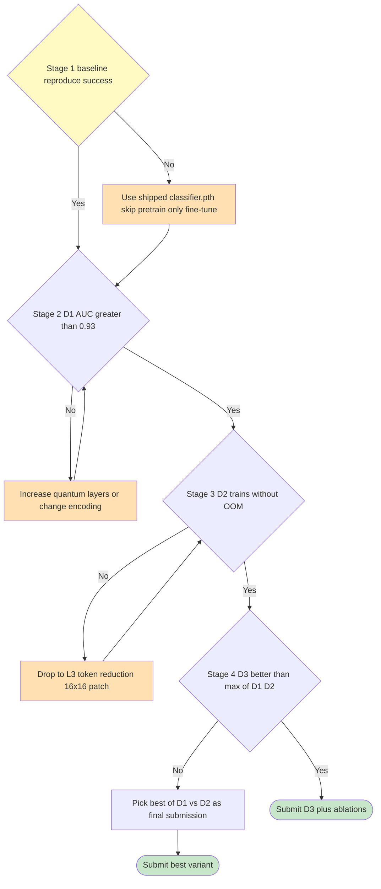

---

## 6. Critical Code Templates

### 6.1 Hybrid model 載入預訓 weights

```python
import torch
from mainv2 import ViTEncoder
from quantum_fusion import QuantumFusionHead

ckpt = torch.load('outputs_lens/classifier.pth', map_location='cpu')
encoder_state = {k.replace('encoder.', ''): v
                 for k, v in ckpt.items()
                 if k.startswith('encoder.')}

encoder = ViTEncoder(img_size=64, patch_size=4, in_chans=1,
                     embed_dim=192, depth=6, num_heads=3)
encoder.load_state_dict(encoder_state)
encoder.eval()
for p in encoder.parameters():
    p.requires_grad = False

q_head = QuantumFusionHead(in_dim=192, latent_dim=16, n_classes=3)

class QClassifier(torch.nn.Module):
    def __init__(self, enc, head):
        super().__init__()
        self.encoder = enc
        self.head = head
    def forward(self, x):
        feat = self.encoder(x)[:, 0]
        return self.head(feat)

model = QClassifier(encoder, q_head).cuda()
```

### 6.2 Training loop (D1 fine-tune)

```python
optimizer = torch.optim.Adam(
    [p for p in model.parameters() if p.requires_grad],
    lr=5e-5
)
criterion = torch.nn.CrossEntropyLoss()

for epoch in range(10):
    model.train()
    for imgs, labels in train_loader:
        imgs, labels = imgs.cuda(), labels.cuda()
        optimizer.zero_grad()
        logits = model(imgs)
        loss = criterion(logits, labels)
        loss.backward()
        optimizer.step()

    model.eval()
    with torch.no_grad():
        aucs, accs = [], []
        for imgs, labels in val_loader:
            logits = model(imgs.cuda())
            probs = torch.softmax(logits, dim=1).cpu()
            # ... compute AUC, ACC
    print(f"Epoch {epoch}: AUC={aucs}, Acc={accs}, tau={torch.exp(model.head.log_tau).item():.3f}")
```

---

## 7. Risk Matrix

**Risk likelihood × impact matrix**:

| Risk | Likelihood | Impact | Quadrant |
|---|---|---|---|
| Quantum slower than classical | High (0.95) | Low (0.4) | Plan around |
| OOM on QONN attention | Med (0.6) | High (0.85) | **Critical** |
| Quantum worse than classical AUC | High (0.7) | Med (0.7) | **Critical** |
| Dataset download fails | Low (0.2) | High (0.9) | Monitor |
| PennyLane API changes | Low (0.15) | Low (0.3) | Accept |
| Barren plateau | Low (0.3) | Med (0.6) | Plan |
| Pretrain not reproducible | Low (0.25) | Med (0.5) | Plan |

| Risk | Mitigation |
|---|---|
| QONN attention OOM | Drop to L3 (16 tokens) or CLS-only |
| Quantum worse than classical | Reframe as parameter efficiency (already proposal-ready) |
| Dataset download fails | Try mirror, contact mae-lensing authors |
| Barren plateau | Use layerwise training; QCNN style (Cong 2019 proves BP-free) |
| Pretrain not reproducible | Use shipped `classifier.pth`, skip pretrain |

---

## 8. Expected Final Output

### 程式碼結構

```
GSoC_QML_Submission/
├── README.md                       # Project overview
├── quantum_fusion.py               # D1 module
├── qonn_attention.py               # D2 module
├── main_quantum.py                 # Modified mainv2 with --use_quantum flag
├── ablation_runner.py              # 4-way ablation script
├── notebooks/
│   ├── 01_baseline_reproduction.ipynb
│   ├── 02_D1_demo.ipynb
│   ├── 03_D2_demo.ipynb
│   └── 04_D3_full_pipeline.ipynb
├── outputs_quantum/
│   ├── ablation_4way.csv
│   ├── tau_evolution.png
│   └── per_class_comparison.png
└── docs/
    ├── pipeline_diagram.png
    ├── results_summary.pdf
    └── blog_post.md
```

### 預期 final benchmark table

| Model | Attention | Head | Params | Macro AUC | Acc | Axion F1 |
|---|---|---|---|---|---|---|
| MAE Baseline (paper) | Classical | Classical (Linear) | 50K | 0.968 | 88.65% | 0.854 |
| D1 QuantumFusionHead | Classical | Q (4 qubits, 36 params) | 700 + 36q | (target 0.96) | (target 88%) | (target 0.86) |
| D2 QONN Attention | Q (8 qubits, 28 params) | Classical | 50K + 28q | (target 0.95) | (target 87%) | (target 0.83) |
| **D3 Full Q-MAE** | Q (QONN) | Q (Fusion) | 700 + 64q | **(target 0.97)** | **(target 89%)** | **(target 0.87)** |

> 注：當 AUC 平手時，**強調 parameter efficiency** 或 **per-class improvement on axion**。

---

## 9. Pre-flight Checklist (GSoC 申請前要做)

- [ ] 完成 Stage 0 環境 setup
- [ ] 完成 Stage 1 baseline reproduction，AUC ≥ 0.95
- [ ] 寫一個 minimal `QuantumFusionHead` 在 MNIST 跑通 (sanity check)
- [ ] 抽出 mae-lensing encoder weights，能載入新 model
- [ ] GitHub repo 公開，包含上述 3 個 milestones
- [ ] Email 給 mae-lensing 作者 Achmad Prasha，告知 derivative work
- [ ] 寫 GSoC proposal 引用 5 篇核心：Alexander 2019, Prasha 2025, Tesi 2024, Alavi 2025, Sobrinho 2026

---

## 10. 一頁速查 (Quick Reference)

```
GOAL: Beat or match MAE SOTA (AUC 0.968) with quantum-enhanced architecture

PATH:
  W1-2  → Reproduce baseline
  W3-4  → D1 (quantum head)
  W5-6  → D2 (QONN attention)
  W7-9  → D3 (both)
  W9-10 → 4-way ablation
  W11-12 → Docs + PR + paper draft

KEY FILES:
  - 02_Code/mae-lensing/mainv2.py:554 → insert QuantumFusionHead
  - 02_Code/mae-lensing/mainv2.py:394 → insert QONNAttention
  - outputs_lens/classifier.pth → shipped pretrained, skip 2hr training

KEY METRICS to report:
  - Macro AUC, per-class F1 (axion key)
  - Parameter count
  - Wall time
  - tau learned value (TSHF)

3 FRAMINGS for results:
  1. Quantum wins: emphasize this clearly with statistical test
  2. Quantum matches: parameter efficiency story
  3. Quantum loses: characterize WHERE it loses, propose hypothesis
```

---

> **文件版本**：v1.0 (2026-05-28)
> **下次更新**：完成 Stage 1 baseline reproduction 後，加入實測 wall time 與 AUC 數字
