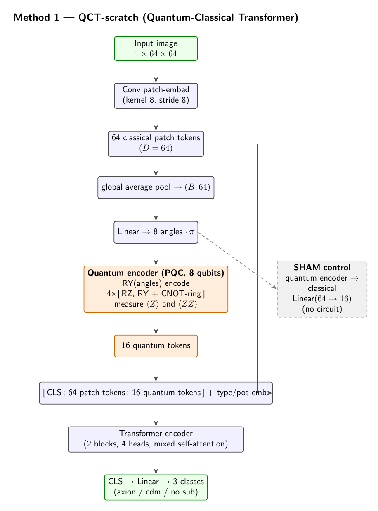
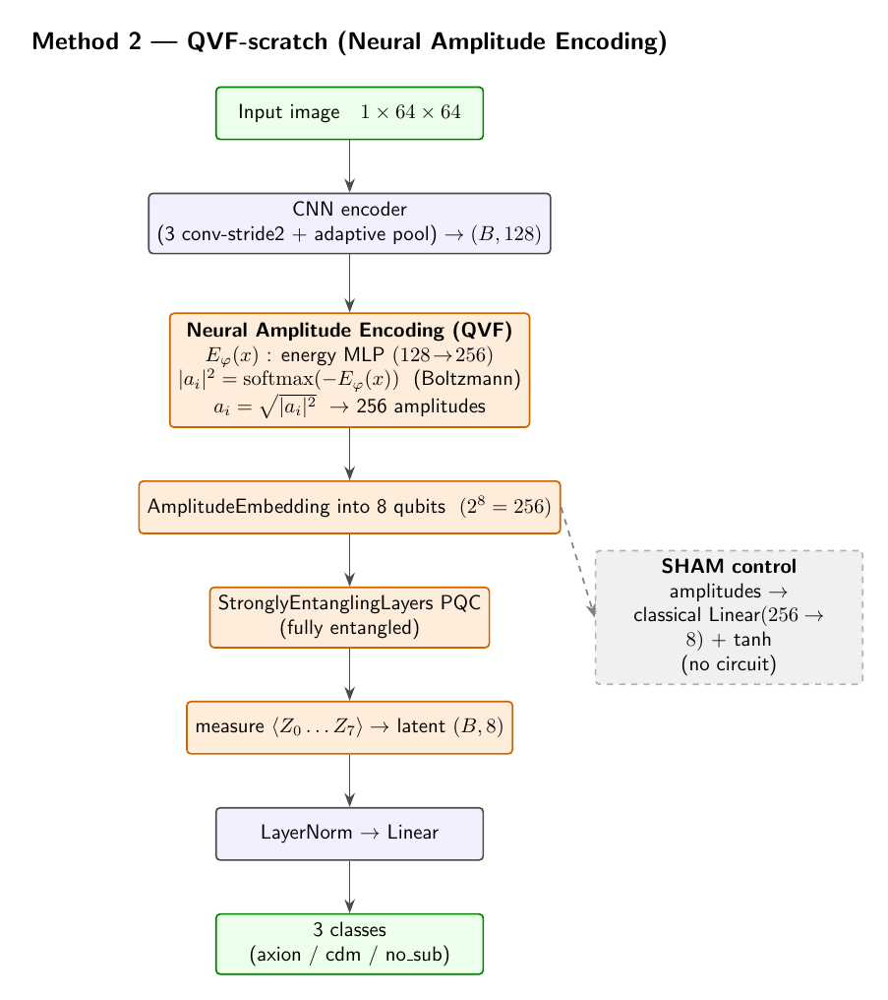
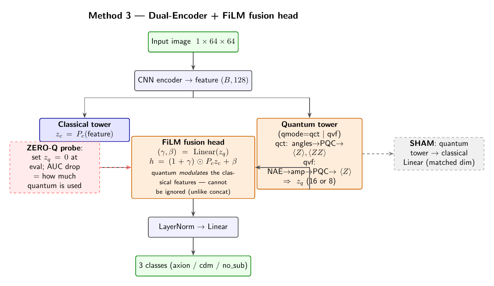

# Method figures

TikZ flowcharts of the three live quantum methods (compiled from `*.tex`).

| Method | Figure |
|---|---|
| QCT-scratch (Quantum-Classical Transformer) |  |
| QVF-scratch (Neural Amplitude Encoding) |  |
| Dual-Encoder + FiLM fusion head |  |

Rebuild: `pdflatex <name>.tex && pdftoppm -png -r 150 <name>.pdf <name>`
