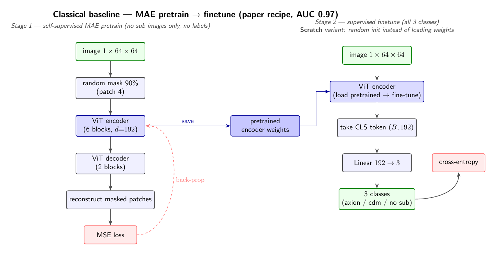
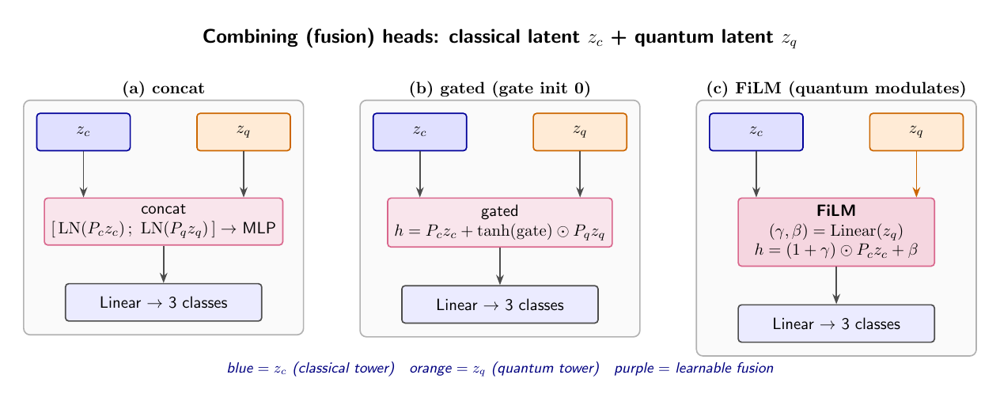
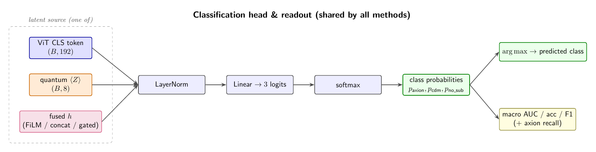

# Method figures (TikZ)

Compiled flowcharts of the full pipeline. Sources are `*.tex`; rebuild with
`pdflatex <name>.tex && pdftoppm -png -r 150 <name>.pdf <name>`.

## Classical baseline

## Quantum methods
| Method | Figure |
|---|---|
| QCT-scratch (Quantum-Classical Transformer) |  |
| QVF-scratch (Neural Amplitude Encoding) |  |
| Dual-Encoder + FiLM fusion head |  |

## Shared components
| Component | Figure |
|---|---|
| Combining (fusion) heads: concat / gated / FiLM |  |
| Classification head & readout |  |
